# Segmentation VLAN & Contrôle d'accès (ACL)
 
## Sommaire
 
1. [Topologie](#topologie)
2. [Plan d'adressage](#plan-dadressage)
3. [Serveurs](#serveurs)
4. [Étape 1 : Construction de la topologie](#étape-1--construction-de-la-topologie)
5. [Étape 2 : Routage inter VLAN](#étape-2--routage-inter-vlan)
6. [Étape 3 : ACL standard (restriction de l'administration)](#étape-3--acl-standard-restriction-de-ladministration)
7. [Étape 4 : ACL étendues (filtrage inter VLAN)](#étape-4--acl-étendues-filtrage-inter-vlan)
8. [Tests de validation](#tests-de-validation)
---
 
## Topologie
 
```
                    [Routeur Inter VLAN]
                          │
                    Trunk (802.1Q)
                          │
                     [Switch L2]
                    ┌──┬──┬──┬──┐
                    │  │  │  │  │
                  DIR RH CPT VIS SRV
```
 
---
 
## Plan d'adressage
 
| VLAN | ID | Nom | Réseau | Passerelle |
|---|---|---|---|---|
| Direction | 10 | DIRECTION | 192.168.10.0/24 | 192.168.10.1 |
| Ressources Humaines | 20 | RH | 192.168.20.0/24 | 192.168.20.1 |
| Comptabilité | 30 | COMPTA | 192.168.30.0/24 | 192.168.30.1 |
| Visiteurs | 40 | VISITEURS | 192.168.40.0/24 | 192.168.40.1 |
| Serveurs | 99 | SERVEURS | 192.168.99.0/24 | 192.168.99.1 |
 
---
 
## Serveurs
 
| Serveur | VLAN | Adresse IP | Rôle |
|---|---|---|---|
| SRV-RH | 99 | 192.168.99.10 | Données RH (paie, contrats, dossiers personnel) |
| SRV-COMPTA | 99 | 192.168.99.20 | Données comptables (facturation, bilan, trésorerie) |
 
---
 
## Étape 1 : Construction de la topologie
 
### 1.1 Placement des équipements
 
Je place les équipements avec leur nom et leur correspondance VLAN ID.
 
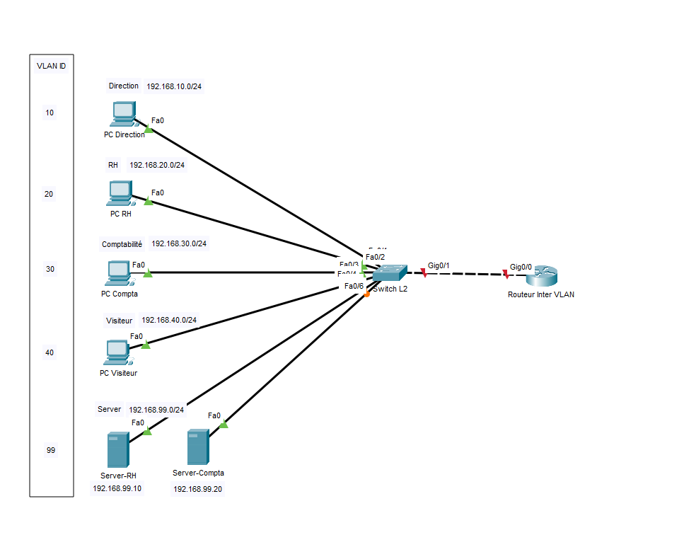
 
### 1.2 Création des VLAN sur le switch
 
Attribution des différents VLAN sur le switch avec la commande :
 
```
configure terminal
```
 
Exemple pour le VLAN Direction :
 
```
vlan 10
name DIRECTION
exit
```
 
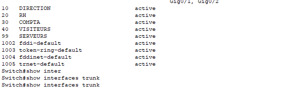
 
### 1.3 Attribution des ports en mode access
 
Sélection de l'interface (le port) à configurer :
 
```
interface fastethernet 0/1
switchport mode access
switchport access vlan 10
```
 
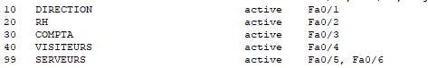
 
### 1.4 Configuration du lien trunk
 
Configuration de l'interface trunk sur le switch Cisco.
 
```
configure terminal
interface GigabitEthernet0/1
switchport mode trunk
```
 
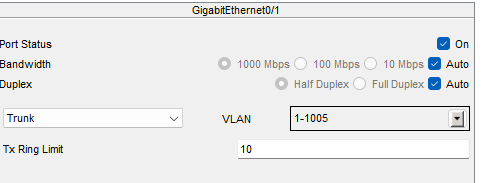
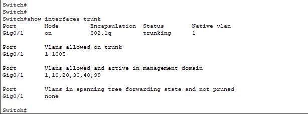
 
---
 
## Étape 2 : Routage inter VLAN
 
### 2.1 Configuration des sous interfaces
 
Configuration des sous interfaces sur le routeur (encapsulation 802.1Q), pour chacun des VLAN créés : 10, 20, 30, 40, 99.
 
On choisit une interface :
 
```
interface gigabitEthernet 0/0.10
```
 
**encapsulation** : indique au routeur qu'il doit écouter et ajouter des « étiquettes » (tags) sur les paquets de données qui entrent et sortent de cette sous interface.
 
**dot1Q** : spécifie le protocole standard utilisé pour le marquage des VLAN, à savoir le IEEE 802.1Q.
 
**10** : désigne l'identifiant du VLAN (VLAN ID). Cette sous interface traitera exclusivement le trafic qui appartient au VLAN 10.
 
```
encapsulation dot1Q 10
```
 
Ici on choisit la plage d'adresses attribuée à notre sous interface :
 
```
ip address 192.168.10.1 255.255.255.0
exit
```
 
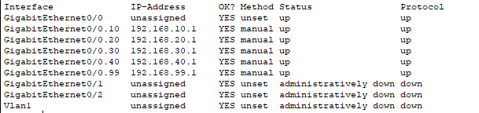
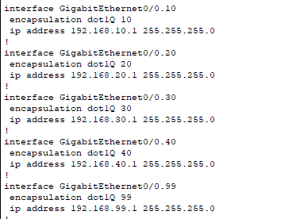
 
Ici je m'assure que tous les services peuvent se pinguer entre eux et avec les passerelles.
 
---
 
## Étape 3 : ACL standard (restriction de l'administration)
 
**Objectif** : seul le réseau Direction (192.168.10.0/24) doit pouvoir accéder aux lignes VTY (Telnet/SSH) du routeur. Tous les autres réseaux doivent être refusés.
 
### Rappel : qu'est ce qu'une ACL standard ?
 
Une ACL standard filtre le trafic uniquement sur l'adresse IP source. Elle est identifiée par un numéro entre 1 et 99 (ou un nom). On l'utilise typiquement pour contrôler l'accès à l'administration d'un équipement.
 
```
access-list 10 permit 192.168.10.0 0.0.0.255
```
 
Le wildcard mask est l'inverse du masque de sous réseau : pour un /24 (255.255.255.0), le wildcard est 0.0.0.255. Il indique quels bits de l'adresse doivent correspondre (0 = doit correspondre, 1 = indifférent).
 
```
line vty 0 4
 access-class 10 in
```
 
**Vérification :**
 
```
show access-lists
```
 
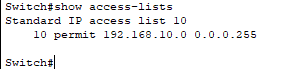
 
---
 
## Étape 4 : ACL étendues (filtrage inter VLAN)
 
**Objectif** : implémenter la politique d'accès du tableau ci dessous en filtrant les flux entre VLAN.
 
### Rappel : qu'est ce qu'une ACL étendue ?
 
Une ACL étendue filtre sur l'adresse source, l'adresse de destination, le protocole et éventuellement le port. Elle est identifiée par un numéro entre 100 et 199 (ou un nom). Elle offre un contrôle beaucoup plus fin qu'une ACL standard.
 
Exemples concrets pour illustrer la syntaxe :
 
```
! Autoriser tout le trafic IP du réseau 192.168.10.0/24 vers n'importe quelle destination
access-list 110 permit ip 192.168.10.0 0.0.0.255 any
 
! Autoriser le trafic du réseau 192.168.20.0/24 vers un hôte précis uniquement
access-list 120 permit ip 192.168.20.0 0.0.0.255 host 192.168.99.10
 
! Refuser tout le reste (implicite, mais peut être écrit pour la lisibilité)
access-list 120 deny ip any any
```
 
L'ordre des règles est crucial : placez les règles les plus spécifiques (permit vers un hôte précis) avant les règles générales (deny any any).
 
Une ACL étendue s'applique sur une interface (ici, les sous interfaces du routeur) avec un sens :
 
- **in** : le trafic est filtré à l'entrée de l'interface (quand il arrive du VLAN vers le routeur).
- **out** : le trafic est filtré à la sortie de l'interface (quand il quitte le routeur vers le VLAN).
```
interface GigabitEthernet0/0.20
 ip access-group <numéro ACL> in
```
 
Syntaxe générale :
 
```
access-list <numéro> permit|deny <protocole> <source> <wildcard> <destination> <wildcard> [eq <port>]
```
 
### Politique d'accès à respecter
 
Voici la politique définie par le responsable IT. Chaque règle doit être traduite en configuration ACL.
 
| Source | Destination | Autorisation | Justification |
|---|---|---|---|
| Direction (VLAN 10) | Tous les VLAN et serveurs | ✅ Autorisé | La direction doit pouvoir accéder à l'ensemble des ressources internes |
| RH (VLAN 20) | SRV-RH uniquement | ✅ Autorisé | Le service RH n'a besoin que des données RH |
| RH (VLAN 20) | SRV-COMPTA, autres VLAN | ❌ Interdit | Principe du moindre privilège |
| Comptabilité (VLAN 30) | SRV-COMPTA uniquement | ✅ Autorisé | Le service compta n'a besoin que des données comptables |
| Comptabilité (VLAN 30) | SRV-RH, autres VLAN | ❌ Interdit | Principe du moindre privilège |
| Visiteurs (VLAN 40) | Internet (simulé) | ✅ Autorisé | Les visiteurs ne doivent accéder qu'à Internet |
| Visiteurs (VLAN 40) | Tout le LAN interne | ❌ Interdit | Isolation stricte du réseau invité |
| Tous les VLAN | Administration routeur (VTY) | ❌ Interdit par défaut | / |
| Direction (VLAN 10) | Administration routeur (VTY) | ✅ Autorisé | Seul le service IT (localisé en Direction) administre les équipements |
 
### Direction (VLAN 10)
 
```
access-list 110 permit ip 192.168.10.0 0.0.0.255 any
```
 
### RH (VLAN 20)
 
```
access-list 120 permit ip 192.168.20.0 0.0.0.255 host 192.168.99.10
access-list 120 deny ip any any
```
 
### Comptabilité (VLAN 30)
 
```
access-list 130 permit ip 192.168.30.0 0.0.0.255 host 192.168.99.20
access-list 130 deny ip any any
```
 
### Visiteurs (VLAN 40)
 
```
access-list 140 deny ip 192.168.40.0 0.0.0.255 192.168.10.0 0.0.0.255
access-list 140 deny ip 192.168.40.0 0.0.0.255 192.168.20.0 0.0.0.255
access-list 140 deny ip 192.168.40.0 0.0.0.255 192.168.30.0 0.0.0.255
access-list 140 deny ip 192.168.40.0 0.0.0.255 192.168.99.0 0.0.0.255
access-list 140 permit ip any any
```
 
### Tous les VLAN — accès administration (VTY)
 
```
access-list 10 permit 192.168.10.0 0.0.0.255
```
 
### Application des ACL sur les sous interfaces
 
Les ACL étendues sont appliquées en `in` sur la sous interface du VLAN source.
 
```
interface GigabitEthernet0/0.10
 ip access-group 110 in
 
interface GigabitEthernet0/0.20
 ip access-group 120 in
 
interface GigabitEthernet0/0.30
 ip access-group 130 in
 
interface GigabitEthernet0/0.40
 ip access-group 140 in
 
line vty 0 4
 access-class 10 in
```
 
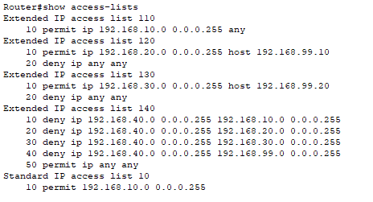
 
---
 
## Tests de validation
 
| Test | Résultat |
|---|---|
| Ping de Direction vers SRV-RH | ✅ Succès |
| Ping de Direction vers SRV-COMPTA | ✅ Succès |
| Ping de RH vers SRV-RH | ✅ Succès |
| Ping de RH vers SRV-COMPTA | ❌ Échec |
| Ping de Comptabilité vers SRV-COMPTA | ✅ Succès |
| Ping de Comptabilité vers SRV-RH | ❌ Échec |
| Ping de Visiteur vers n'importe quel serveur | ❌ Échec |
| Telnet/SSH vers le routeur depuis Direction | ✅ Succès |
| Telnet/SSH vers le routeur depuis RH ou Visiteur | ❌ Échec |
 
### Détail des tests
 
**Ping de Direction vers SRV-RH**

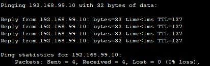

✅ Succès
 
**Ping de Direction vers SRV-COMPTA**

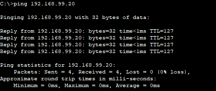

✅ Succès
 
**Ping de RH vers SRV-RH**

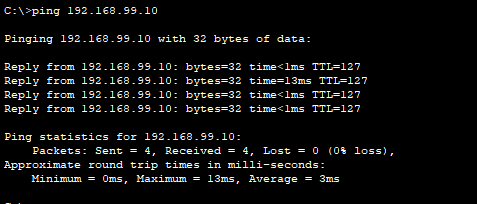

✅ Succès
 
**Ping de RH vers SRV-COMPTA**

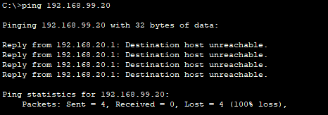

❌ Échec (comportement attendu, conforme à la politique du moindre privilège)
 
**Ping de Comptabilité vers SRV-COMPTA**

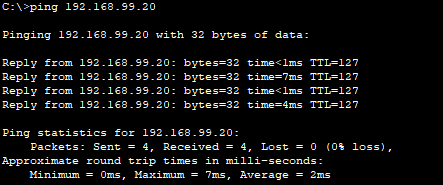

✅ Succès
 
**Ping de Comptabilité vers SRV-RH**

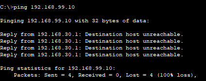

❌ Échec (comportement attendu, conforme à la politique du moindre privilège)
 
**Ping de Visiteur vers n'importe quel serveur**

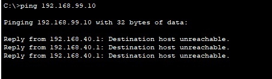

❌ Échec (isolation stricte du réseau invité, conforme à la politique)
 
**Ping de Visiteur vers la passerelle Internet (simulée)**

 
**Telnet/SSH vers le routeur depuis Direction**

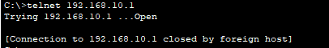

Le routeur a bien accepté la connexion Telnet, mais l'a immédiatement coupée car aucun mot de passe n'est configuré sur les lignes VTY et le login n'est pas activé.
✅ Succès
 
**Telnet/SSH vers le routeur depuis RH ou Visiteur**

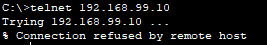

❌ Échec (comportement attendu, conforme à la politique)